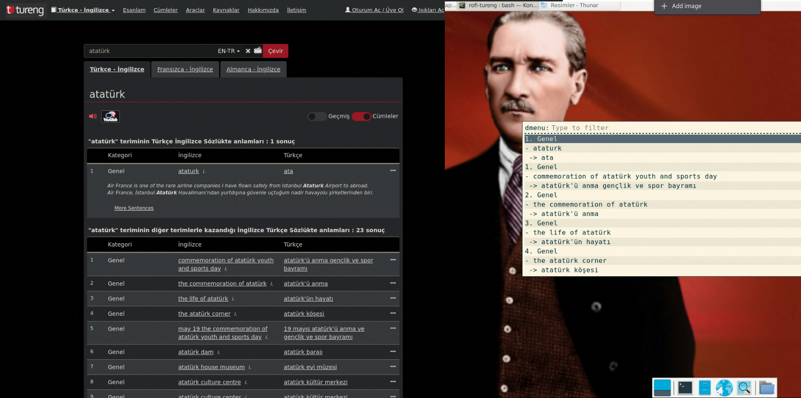

# Rofi Tureng

A tool to use the Tureng Dictionary on Rofi.



## Table of Contents
- [Rofi Tureng](#rofi-tureng)
  - [Table of Contents](#table-of-contents)
  - [Installation](#installation)
  - [Usage](#usage)
    - [URL Variable](#url-variable)
      - [Defining the URL Variable](#defining-the-url-variable)
      - [Explanation](#explanation)
  - [Contributing](#contributing)
  - [License](#license)

## Installation

Follow these steps to install the project:

1. Clone the repository:
    ```sh
    git clone https://github.com/AzizEmir/rofi-tureng.git
    cd rofi-tureng
    ```

2. Install the necessary dependencies:
    ```sh
    python3 -m venv myenv
    source myenv/bin/activate
    pip install -r requirements.txt
    ```

3. Set up any additional configuration if required.

## Usage

To use the Tureng Dictionary on Rofi, follow these steps:

1. Run the script:
    ```sh
    bash rofi-tureng
    ```

2. Follow the prompts in Rofi to look up words in the Tureng Dictionary.

### URL Variable

To modify the URL used for querying the Tureng Dictionary, you can adjust the `url` variable in the script (`rofi-tureng` file). Here's how you can do it:

#### Defining the URL Variable

Currently, the script contains the following line to define the URL:

```bash
url="https://tureng.com/tr/turkce-ingilizce/$encoded_input"
```

This URL is used to search for words in the **Turkish-English** dictionary. However, if you want to use the **English-Turkish** dictionary instead, you can modify the URL like this:

```bash
url="https://tureng.com/en/turkish-english/$encoded_input"
```

This change will direct the script to query the English-Turkish translation page instead of the Turkish-English page on the Tureng website.

#### Explanation

- The original URL (`https://tureng.com/tr/turkce-ingilizce/$encoded_input`) is for the **Turkish to English** dictionary.
- By changing the `tr` to `en` and updating the path accordingly, the new URL (`https://tureng.com/en/turkish-english/$encoded_input`) points to the **English to Turkish** dictionary.

This modification ensures that the script searches in the correct dictionary based on your preference.

## Contributing

We welcome contributions! Please follow these steps to contribute:

1. Fork the repository.
2. Create a new branch:
    ```sh
    git checkout -b feature-branch
    ```
3. Make your changes and commit them with a meaningful message:
    ```sh
    git commit -m "Add new feature"
    ```
4. Push your changes to your forked repository:
    ```sh
    git push origin feature-branch
    ```
5. Create a pull request in the original repository.

## License

This project is licensed under the GPL License. See the [LICENSE](LICENSE) file for more details.